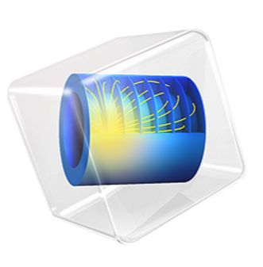

<h1 align="center">Hi 👋, I'm Pranav</h1>
<h3 align="center">Acoustical and Vibration Engineer</h3>

- 🎓 I'm currently working on **retinal image processing** using OpenCV  
- 🔍 Interested in **Machine Learning**, **Medical Imaging**, and **AI for healthcare**
- 🌱 I’m currently learning:  
  - Deep Learning  
  - Morphological Operations  
  - Edge Detection & Thresholding Techniques  
- 📂 All my projects are available at: [My GitHub Portfolio]([https://github.com/your-username](https://pranavduraivel.github.io))

- 💬 Ask me about: `Python`, `Signal Processing`, `Active control of Sound and Vibration`
- 📫 How to reach me: rickypranav@outlook.com

---

### 🧑‍💻 Connect with me:

  

---

### 🛠️ Languages and Tools:

  
  
  
  
  
  
  

### 📊 GitHub Stats:

  
  

---

### 📌 Featured Projects:
- 🔬 **Loudspeaker Design**
- 📊 **Piano Soundboard Modelling**
- 🧠 **Musical Theatre Design**

---

<!-- Hidden comment for future edits -->
